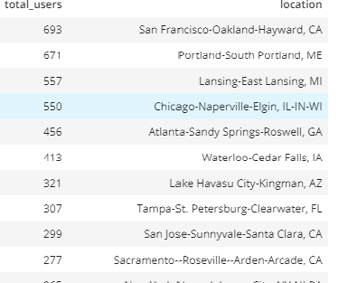

## Sparkify Song Play Analysis
### 1. Discuss the purpose of this database in the context of the startup, Sparkify, and their analytical goals.

   Sparkify is a startup application based on music streaming. The analytics team at Sparkify wants to analyze the trends on songs          data that has been collected and also about the songs their users are listening to. As the data is collected is in the form of          json logs sourced from their application they need this data to be stored in database in a way, on which they can easily query          the data.
    
### 2. State and justify your database schema design and ETL pipeline.
    
  Based on the needs of Sparkify team, i had proposed and designed a database schema. Data Sets songs and user_log are considered and     developed a design based on star schema in which it has 4 dimension tables and 1 fact table as descirbed below.
    
   a. songplays(Fact): It has all the information related to which songs user is listening to. Overall it has start_time, user_id,            level,song_id, artist_id, session_id, location, user_agent columns.
        
   b. users(dimension): It has details about the user like user_id(PRIMARY_KEY), firstName, lastName, level.
    
   c. songs(dimension): It has detail about the song like songName, yearReleased, duration.
    
   d. artists(dimension): It has details about the song artists like artist_id(PRIMARY KEY), name, location, latitude, longitude.
    
   e. time(dimension): THe ts column in the log data dataset broken down into  hour, day, week, month, year, weekday.
    
#### Query performance

Because a star schema database has a small number of tables and clear join paths, queries run faster than they do against an OLTP system. Small single-table queries, usually of dimension tables, are almost instantaneous. Large join queries that involve multiple tables take only seconds or minutes to run.

#### Load performance and administration

Structural simplicity also reduces the time required to load large batches of data into a star schema database. By defining facts and dimensions and separating them into different tables, the impact of a load operation is reduced. Dimension tables can be populated once and occasionally refreshed. You can add new facts regularly and selectively by appending records to a fact table.

#### Built-in referential integrity

A star schema has referential integrity built in when data is loaded. Referential integrity is enforced because each record in a dimension table has a unique primary key, and all keys in the fact tables are legitimate foreign keys drawn from the dimension tables. A record in the fact table that is not related correctly to a dimension cannot be given the correct key value to be retrieved.

#### Easily understood

A star schema is easy to understand and navigate, with dimensions joined only through the fact table. These joins are more significant to the end user, because they represent the fundamental relationship between parts of the underlying business. Users can also browse dimension table attributes before constructing a query.

### 3) Provide example queries and results for song play analysis.

To get the details of usage of application in each location.

select count(user_id) as total_users,location from songplays group by location order by total_users desc.

        
        
